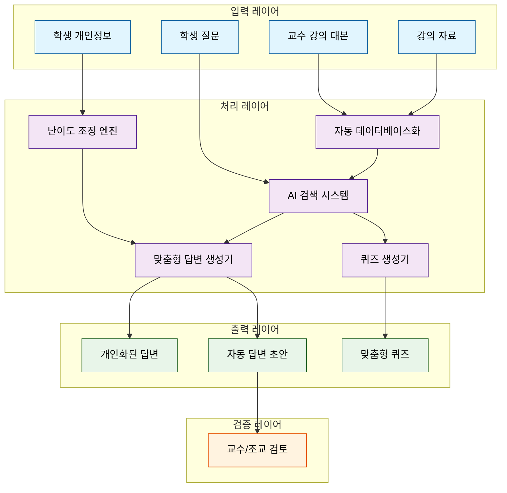

YATA dataflow diagram
![[Pasted image 20241229023510.png]]

각 클래스 정의에 `color:black`을 추가하여 모든 텍스트가 검정색으로 표시되도록 변경했습니다. 이제 배경색과 테두리색은 그대로 유지하면서 글자는 모두 검정색으로 보일 것입니다.
이 코드를 옵시디언 노트에 붙여넣기 하시면 됩니다. 다이어그램은 다음과 같은 구조를 보여줍니다:

1. 입력 레이어 (파란색)
- 강의 자료, 교수 강의 대본, 학생 개인정보, 학생 질문

2. 처리 레이어 (보라색)
- 데이터베이스화, AI 검색, 답변 생성, 난이도 조정, 퀴즈 생성

3. 출력 레이어 (초록색)
- 개인화된 답변, 자동 답변 초안, 맞춤형 퀴즈

4. 검증 레이어 (주황색)
- 교수/조교 검토

화살표는 데이터와 정보의 흐름을 나타내며, 색상 구분을 통해 각 구성 요소의 역할을 쉽게 파악할 수 있습니다.

***
[[AI 대학가 연세대에는 ‘초거대 AI 학생’이 다닌다]]

> [!NOTE]
> 연세대, 국내최초 A조교 도입..학생 눈높이까지 고려해 수업내용 기반 답변
> RAG(검색 증강 생성), 시뮬레이션 이론 등 최첨단 NLP(자연어처리 기법) 적용

연세대학교는 학생들에게 수업 내용을 기반으로 개인맞춤형 질문답변 서비스를 제공해줄 수 있는 인공지능(AI) 조교, 야타(YATA, Yonsei Academic Teaching Assistant)를 도입한다고 30일 밝혔다.

연세대에 따르면 최근 Al분야에 대한 연구가 활발해지면서, 학교에 축적 된 학습 데이터를 활용한 부가가치 창출에 기대가 커지고 있다. 한편 교수자들은 반복적인 질문 응답을 자동화해 보다 본질적인 교육 활동에 집중 하고자 하는 수요가 있었으며, 학생들은 시공간 제약 없는 학습 지원과 개개인의 학습 속도에 맞는 눈높이 교육에 대한 수요가 있었다. AI 조교 서비스를 추진한 차호정 연세대 인공지능융합대학 학장은 "AI 기술이 일정 수준을 넘어서면서, 그동안 교수자들이 가졌던 어려움과 학생들의 교육 수 요를 동시에 충족시켜줄 수 있는 정도가 됐다고 판단했다"며 "AI 조교를 비롯해 다양한 교육 서비스에 Al를 접목할 계획이다" 라고 밝혔다.

연세대에 따르면 YATA의 첫 번째 특장점은 교수자의 철학이 AI의 답 변에 녹아든다는 것이다. YATA는 특정 수업을 듣는 학생이 질문을 하면 해당 수업 내용을 바탕으로 답변해주도록 기획됐다. 이를 위해 수업에 사 용된 자료들, 교수자의 수업 내용을 담은 대본 등이 자동으로 데이터베이 스화된다. 이후 학생의 질문을 받으면 AI 검색시스템이 데이터베이스에서 이와 관련된 부분을 인출해오고, 이를 기반으로 답변을 생성하게 된다. 이 때문에 학생이 같은 질문을 하더라도, 어떤 교수의 수업이냐에 따라 다양 한 답변이 나오게 된다. 이는 하나의 질문에 대해서는 일률적인 답을 내놓 는 오픈Al, 구글 등 빅테크 AI들과 차별화되는 지점이다.

더 놀라운 두 번째 장점은 YATA가 학생들의 눈높이까지 고려한다는 것
이다. YATA는 질문하는 학생의 전공, 이전 수강과목 등 개인정보를 바탕 으로 질문의 상대적 난이도를 판단해 답변하도록 설계됐다. 예를 들어 "자 본주의가 뭐야?"라는 질문에 대해, 이공계열 기반 학생에게는 해당 개념을 이해하기 위한 기초적인 내용부터 차근차근 알려주는 반면, 경제 사회학 관련 과목 수강 이력이 많은 학생에게는 보다 심화된 수준의 수업내용을 전해준다. 이처럼 YATA는 교수자와 학생 양 방향을 모두 고려한 맞춤형 질문답변 서비스를 제공한다.

YATA는 수업의 질의응답 게시관에도 적용된다. 한 학기당 수업 하나에 수백 개의 질문이 쏟아지는데, 앞으로 사람이 일일이 답변을 하는 대신 YATA가 자동으로 답변 초안을 작성하면 조교나 교수가 확인 후 등록을 하는 식으로 부담을 덜어준다. 또 강의내용에 대한 이해를 돕도록 강의 기 반 퀴즈를 생성해주는 기능도 추가됐다.

이 같은 장치를 위해 다양한 첨단 자연어 처리(NLP) 기법들이 도입됐 다. 우선 질문을 이해하고 분류, 최종 답변을 생성하는 엔진은 초거대 언 어모델(LLM)이 활용된다. 또 질문과 관련된 수업자료를 검색하는 데에는 AI 기반 검색기술과 더불어 RAG(검색 증강 생성) 기법이 적용된다. 이는 빅테크 기업인 마이크로소프트(MS)의 Al 질문답변 서비스 빙(Bing) 등에 적용된 기술이다. 또 학생의 눈높이에 꼭 맞는 답변을 하기 위해, 언어학 의 '시뮬레이션 이론'이 접목된 최신 프롬프트 엔지니어링 기술이 도입됐 다. 발화자의 답변이 상대방에게 어떻게 작용할지 예상하며 답변의 적합도 를 높이는 기법이다.

국내 NLP 학계 선두주자 중 하나로 꼽히는 연세대 인공지능융합대학은 국내에서 최초로 이 같은 Al 조교 시스템을 개발했으며, 교내 정식 도입을 눈앞에 두고 있다. 연세대는 차 학장이 AI를 통한 교육 서비스의 가능성에 주목하면서, YATA 외에도 자체 데이터를 학습시킨 초거대 AI 아카라마 등 다양한 시도가 계속되고 있다. YATA 개발을 진두지휘한 감독은 신임 교수인 여진영 연세대 인공지능융합대학 조교수가 맡았다. 여 교수가 지도 하는 DL(데이터 언어 지능) 연구소는 올해 상반기에만 10여편의 NLP 관련 련 글로벌 탑티어 학회(ACL, NAACL, EACL, AAAI) 논문을 쏟아냈다.
***
![[Pasted image 20241223020521.png|300]]
![[Pasted image 20241223020559.png|300]]